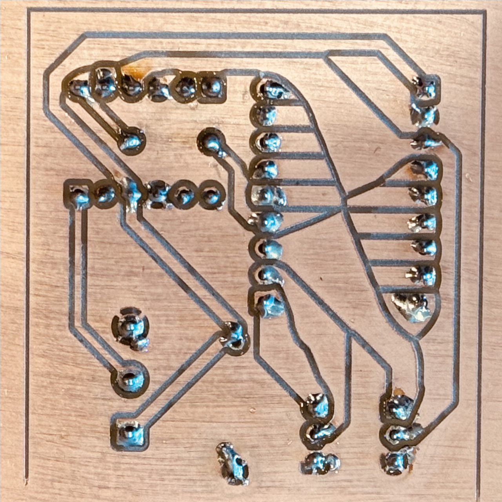

# Milling a PCB with auto-leveling using a Carbide 3D Nomad 3

I tried everything between [Carbide Copper](https://carbide3d.com/copper/), which seems abandoned at best and buggy at worst: it does not seem to spin the spindle. I played with [FlatCAM](http://flatcam.org/) and [bCNC](https://github.com/vlachoudis/bCNC), which I used to brick my Nomad 3. (I provide [instructions to reset the GRBL on a Nomad 3](https://github.com/thomergil/carbide3d-grbl-recovery?tab=readme-ov-file), much thanks to Carbide 3D support.)

Ultimately, I settled on [pcb2gcode](https://github.com/pcb2gcode/pcb2gcode) for generating G-code and [coppercli](https://github.com/thomergil/coppercli) for copper milling. coppercli is a cross-platform keyboard-driven CLI, originally based on [OpenCNCPilot](https://github.com/martin2250/OpenCNCPilot).

# Example results





# Video (will navigate you away)

[](https://vimeo.com/1082581671/7f1daaed23)

# Acknowledgements

[Chris Kohlhardt's notes](https://www.chriskohlhardt.com/small-double-sided-pcb-traces-on-nomad-cnc) partly inspired this work. He uses FlatCAM and bCNC. I found both rather inscrutable. Much thanks to [martin2250](https://github.com/martin2250) for [OpenCNCPilot](https://github.com/martin2250/OpenCNCPilot), which coppercli is based on, and for the [feedback](https://github.com/martin2250/OpenCNCPilot/issues/201). Thank you to https://github.com/deHarro. Much thanks to [Eyal](https://github.com/eyal0) for [pcb2gcode](https://github.com/pcb2gcode/pcb2gcode).

# CNC Machine

This has been tested on a [Carbide 3D Nomad 3](https://shop.carbide3d.com/products/nomad-3) CNC Mill.

#  coppercli

[coppercli](https://github.com/thomergil/coppercli) is a terminal-based tool for PCB milling with GRBL CNC machines. Probe-based auto-leveling, automatic tool changes (M6), macros, session recovery, and real-time visualization. Cross-platform. Originally based on [OpenCNCPilot](https://github.com/martin2250/OpenCNCPilot).

# PCB blanks / Copper Clad

🚨 **First of all, and most importantly: DO NOT USE FR4 copper clad in a CNC machine. Only ever use FR1 copper clad. Glass fiber dust is an extremely dangerous health hazard. :skull_and_crossbones:**

I use 2x3" and 4x6" PCB blanks that I order [from Carbide 3D](https://shop.carbide3d.com/collections/materials/products/fr1-copper-clad?variant=41237063046). I have also used 100x150mm and 150x200mm PCB blanks. They are single-sided ("SS") or double-sided ("DS") and are also sold on Amazon and AliExpress. As mentioned above, **only use FR1 copper clad, NEVER USE FR4**.

You'll likely start with your entire PCB on one (the non-copper) side and soldering the pins on the copper side, so **you need single-sided copper clad**.

If you plan to put the ground plane on the opposite side, you will need **double-sided copper clad**. However, I have not yet found a good way to work with double-sided copper clad. Remember that plugging in pins through double-sided copper clad will connect the pins on **both sides of the board, even if you only solder one side**. The edges of the pin will very likely make contact with the copper. I learned this the hard way. 💥

# Drill/Mill bits

30º V-bits:

- [#501 PCB Engraver (30º) bits from Carbide 3D](https://shop.carbide3d.com/products/501-engraving-bit?_pos=3&_psq=pcb&_ss=e&_v=1.0)
- [Coated 30º V-Groove bits from bits&bits](https://bitsbits.com/product/60-degree-v-groove/)
- **[FoxAlien 30º bits via Amazon](https://a.co/d/37hDOj5)** are my favorites as they are very cheap and do the job.

40º V-bits:

- [#502 PCB Engraver (40º) bits from Carbide3D](https://shop.carbide3d.com/products/502-engraving-bit?_pos=2&_psq=pcb&_ss=e&_v=1.0)

60º V-bits:

- [Coated 60º V-Groove bits from bits&bits](https://bitsbits.com/product/425-vg30/)
- [FoxAlien 60º bits via Amazon](https://www.amazon.com/dp/B08881PKBN?ref=ppx_yo2ov_dt_b_fed_asin_title&th=1)

# Jigs

I provide [several different-sized jigs on printables.com](https://www.printables.com/model/1280313-copper-clad-pcb-jig-for-cnc-machine). Please be in touch if you need additional sizes. If you do not have access to a 3D printer, I can print them and send them to you for $49.99 plus shipping. Others can do it, no doubt, for much less. 🙂

# BitZero attachment

You need to rig the [BitZero V2](https://shop.carbide3d.com/products/bitzero-v2-for-nomad-3). Anything works as long as it conducts ground between the top of the copper clad and the BitZero. This is my solution.


# Outline

- Adjust the PCB design.
- Export Gerber files.
- Attach copper to the jig with double-sided tape.
- Zero X, Y, Z.
- Probe to create a height map. This can take 15-30 minutes, depending.
- Mill front (for example, using a 30º V-bit). This can take 30m-3h hours, depending.
- [Optional: flip, mill other side, flip back]
- Replace V-bit with a drill bit (for example, a 0.8mm PCB drill).
- Zero Z.
- Drill holes.
- Drill outline.
- Prepare to solder.
- Solder.

If you are milling both sides, you should **drill after milling both sides**; otherwise, you are level-probing a surface with holes.

# Single-layer design on B.Cu

This tutorial assumes you are making **a single-layer PCB** where you plug in components at the top and solder them at the bottom. This means **your entire PCB design needs to be on B.Cu**.

If you initially designed your board for manufacturing (e.g., JLCPCB, PCBWay, OSH Park, etc.), you likely put the GND plane on B.Cu and the signal traces on F.Cu. That will **not work** for CNC manufacturing. (I discovered this the hard way when all my pin holes were mirrored.)

To adapt the design for CNC manufacturing, you need to move all routing (including GND) to F.Cu. Since GND is no longer taken care of, this likely requires re-routing traces.

While you are at it, you need to also make the tracks wider and clearance wider:


- Using **File** → **Board Setup** → **Design Rules** → **Net Classes**:

  - Set **Clearance to 0.34mm** for all netclasses, the maximum without things getting buggy.
  - Set **Track Width to a minimum of 0.6mm** for all netclasses; I go up to 1mm for higher-voltage classes.
  - Set **Via Size to 0.6mm**.
  - Set **Via Hole to 0.3mm**.
  - Set **µVia Size to 0.3mm**.
  - Set **uVia Hole to 0.1mm**.
  - Set **DP Width to 0.4mm**.
  - Set **DP Gap to 0.5mm**.

- Using **File** → **Board Setup** → **Board Stackup** → **Physical Stackup**

  - Set **Copper layers** to 2 using the drop-down at the top of the window.

If you change this, you need to apply your changes using **Edit** → **Edit Track and Via Properties** → select **Set to net class / custom rule values** and **Apply**. Then run the **Design Rules Checker** and fix any errors due to the width changes. People [have reported thinner track widths](https://github.com/martin2250/OpenCNCPilot/issues/198), though.

Once everything is on F.Cu, you can swap F.Cu and B.Cu (using menu **Edit** → **Swap Layers...**) to transpose F.Cu to the back. Alternatively, if you are not planning to use a PCB manufacturing service, you can do all routing on B.Cu from the start.

# Stating the obvious: check your PCB

This is obvious, but my most frequent mistakes are incorrect rotation of pin headers and misalignment of pins. Hold the parts you will use to the screen. It sounds silly, but holding them next to each other is a great way to find bugs. Check pin assignments. Use the measuring tool in KiCad to check distances between pins (typically multiples of 2.54mm) and alignment. Measure the distance between the physical pins with a caliper to verify your PCB design. (Alternatively, use the Snap To Grid function in the `pcb-action-tools` plugin to do this automatically.) And, of course, **Run DRC** and fix all Violations and Unconnected items.

# KiCad PCB Export

A few things to keep in mind when exporting from KiCad's PCB editor:

- The Edge Cut layer will be where the CNC drills the board out of the copper clad.
- Ensure enough space (at least 2mm) between the edges and the circuitry.
- Using menu **Place** → **Place Drill/Place File Origin**, place the origin at the bottom left of the Edge Cut layer.
- Similarly, using menu **Place** → **Grid Origin**, place the origin at the bottom left of the Edge Cut layer.


# KiCad Plot / Export

Using menu File → Plot...:

- :heavy_check_mark: F. Cu
- :heavy_check_mark: B. Cu
- :heavy_check_mark: Edge.Cuts
- :heavy_check_mark: Use drill/place file origin
- :x: Use extended X2 format (meaning, make sure this option is unchecked)


Press "Plot".

Then:

- Generate Drill Files...
- Excellon format
- Origin: Drill/place file origin
- Units: millimeters
- Zeros: decimal format (recommended)

Then press "Generate".


Back on the Plot window, press "Plot"

# Generate Gcode from .gbr files

Create a file `millproject` in the same directory as the `.gbr` files.

```
# See https://github.com/pcb2gcode/pcb2gcode/wiki/Manual

metric=true
metricoutput=true

# milling
zwork=-0.06          # Depth in mm; -0.06mm and -0.07mm work well for me
zsafe=20			       # Height for movements; start with 20mm, can be 1mm if confident
# zsafe=1            # Height for movements; start with 20mm, can be 1mm if confident
zchange=35           # Height for tool changes
mill-feed=100        # Feed rate in mm/minute; can go up to 600, or even 800.
                     # That will DRAMATICALLY speed up the milling process at the price
                     # of slightly more granural cuts.
mill-speed=12000     # RPM for milling; can go up to 14000 or even 16000
nom6=1               # Suppress tool changes; pcb2gcode-wrapper --multi handles them
spinup-time=3.0      # Time to spin up the spindle in seconds
spindown-time=3.0    # Time to spin up the spindle in seconds
backtrack=1          # Allow retracing through existing path; speedup
isolation-width=0.6  # As thick isolation as possible without running into trouble
milling-overlap=25%  # Re-mill with 25% overlap as part of creating isolation width

# Voronoi regions
voronoi=1            # Try it out! Makes soldering easier, but looks funky; default 0
# min-path-length=0.1 # Not yet in the official release, currently in MR

# drilling
zdrill=-1.7          # Drill depth; measure your copper clad
zmilldrill=-1.7      # Mill drill depth; measure your copper clad
drill-feed=100       # Feed rate in mm/minute; can go up to 200
drill-speed=12000    # RPM for drilling; can go up to 14000
nog81=1              # Use G0/G1 instead of G81/G80; required for coppercli
drills-available=0.8 # Your 0.8 drill bit
min-milldrill-hole-diameter=0.81 # Milldrill anything greater than 1mm
milldrill-diameter=0.8 # Same drill bit as drilling

# outline cutting
zcut=-1.7            # Cut depth for outline; same as drill depth
cut-feed=100         # Feed rate for outline cutting; same as milling
cut-vertfeed=60      # Vertical feed rate; similar to drill-feed; can go up to 20
cut-speed=16000      # RPM for cutting; same as mill-speed
cutter-diameter=0.8  # Diameter of end mill for cutting (in mm)
bridgesnum=0         # No bridges; it's stuck with tape
cut-infeed=0.4       # Max cutting depth per pass

# this will mess up offset! don't use!
# zero-start=true
```

Some of these values are **critically important**:

- `zsafe` is the travel height of the mill bit; **if this is too low your bit will crash into the jig, breaking the mill or worse**. Once you get the hang of it, you can make this as low as 2.
- `zchange` is the height for changing the mill bit; if you choose this number too high and your drill bit is long, the process will error out, because it runs into the hard limit of the machine.
- `zwork` is how deep the mill drills into the copper substrate; start with `0.05` and iterate deeper as needed; this also depends on the V-bit you are using.
- `nom6=1` suppresses tool change commands in individual files. Instead, `pcb2gcode-wrapper --multi` adds tool changes when combining files, giving us control over when and how tool changes happen.
- `nog81` prevents `pcb2gcode` from issuing `G81` commands, which trips up OpenCNCPilot.
- For `--mill-diameters` you can use this [tool cutting width calculator](https://hobbycnc.com/tool-width-calculator/) to figure out the correct number.
- Once you're comfortable with the process, you can **dramatically speed it up** by increasing values marked "can go up to" in the comments above: `mill-feed`, `mill-speed`, `drill-feed`, and `drill-speed`. Higher speeds mean faster operation but may produce slightly rougher cuts.

Run [pcb2gcode](https://github.com/pcb2gcode/pcb2gcode) to generate the **back**, which, confusingly, is what we're going to mill.

```bash
# replace "decibel-meter-B_Cu.gbr" with your own .B_Cu file
# optional: --basename FOO to give file a nice prefix
# optional: --output-dir DIR to write file to another directory
# optional: --x-offset negative number moves the PCB to the right of the origin
#					  this should equal the width of your board
# --mill-diameters: the width of your mill at the given zwork
pcb2gcode --back decibel-meter-B_Cu.gbr --mill-diameters=0.169
```

Generate the Excelon **drill** file:

```bash
# replace "decibel-meter-PTH.drl with your own .drl file
# optional: --basename FOO to give file a nice prefix
# optional: --output-dir DIR to write file to another directory
# optional: --x-offset negative number moves the PCB to the right of the origin
#					  this should equal the width of your board
#           MAKE SURE THIS IS THE SAME AS THE SETTING FOR B_Cu ABOVE
pcb2gcode --drill decibel-meter-PTH.drl --drill-side back
```

Generate the **outline** file:

```bash
# replace "decibel-meter-PTH.drl with your own .drl file
# optional: --basename FOO to give file a nice prefix
# optional: --output-dir DIR to write file to another directory
# optional: --x-offset negative number moves the PCB to the right of the origin
#					  this should equal the width of your board
#           MAKE SURE THIS IS THE SAME AS THE SETTING FOR B_Cu ABOVE
pcb2gcode --outline decibel-meter-Edge_Cuts.gbr --cut-side back
```

Alternatively, install my [pcb2gcode-tools](https://github.com/thomergil/pcb2gcode-tools) package:

```bash
brew install pipx
pipx install git+https://github.com/thomergil/pcb2gcode-tools
```

Then run `pcb2gcode-wrapper`, which invokes all three scripts with the same parameters, automatically calculates offsets from your `Edge_Cuts.gbr` file, and post-processes the output:

```bash
$ pcb2gcode-wrapper decibel-meter --mill-diameters=0.169
```

The wrapper automatically calculates the `--x-offset` from the board width: `x-offset = -1 * (ceil(width_mm) + x_margin)`. The default `x_margin` is 5mm. The `--y-offset` defaults to 3mm (the `y_margin` value). You can override these defaults:

```bash
$ pcb2gcode-wrapper decibel-meter --mill-diameters=0.169 --x-margin 10 --y-margin 7
```

The wrapper automatically runs `pcb2gcode-fixup` (swaps initial XY/Z moves for safety) and `pcb2gcode-combine` (merges drill/milldrill/outline into a single file when they use the same bit).

For a single-file workflow with automatic tool changes, add `--multi`:

```bash
$ pcb2gcode-wrapper decibel-meter --mill-diameters=0.169 --multi
```

This creates an additional `_000_all.ngc` file that combines milling and drilling with automatic tool change pauses. When you run this file in coppercli, it will pause at each tool change, guide you through swapping bits, and re-zero Z using the tool setter (if configured) or manual probing.

Either way, you should now have `.ngc` files.

# Attach copper clad to jig

Cover the entire bottom surface of the copper clad (all the way to the edges) with non-overlapping double-sided tape. Don't just tape the middle because the sides will flex downward during probing.


Then press the copper clad into the jig with a poper towel:


#  coppercli

[coppercli](https://github.com/thomergil/coppercli) is a terminal-based tool for PCB milling with GRBL CNC machines. Probe-based auto-leveling, automatic tool changes (M6), macros, session recovery, and real-time visualization. Cross-platform. Originally based on [OpenCNCPilot](https://github.com/martin2250/OpenCNCPilot). See the [coppercli README](https://github.com/thomergil/coppercli#readme) for installation instructions and full documentation.

### General notes

- As you learn, **stay close to your CNC machine with your finger on the power switch**.
- While learning, I destroyed a half-dozen mill bits. You should **start with cheap throwaway bits**.
- coppercli is entirely keyboard-driven. Use arrow keys to navigate menus and select options.
- Use **Jog** to move the spindle. Arrow keys move X/Y, Page Up/Down moves Z. Press `Tab` to cycle through speed presets (Fast/Normal/Slow/Creep).

### coppercli and Carbide Motion don't play nice

Switching **to** coppercli after using Carbide Motion is usually OK. However, using Carbide Motion **after** coppercli can fail in mysterious ways, starting with initialization and homing. Stay close and keep your finger on the power button. If weird things happen, follow my [instructions to reset the GRBL on a Nomad 3](https://github.com/thomergil/carbide3d-grbl-recovery?tab=readme-ov-file).

### Start coppercli

Run `coppercli` from the command line. On first run, go to **Settings** and select your **Machine Profile** (e.g., Nomad 3). This configures the machine-specific tool setter position.

From the main menu, choose **Connection**. coppercli will auto-detect your serial port and baud rate. Once connected, it will offer to home the machine.

**If it's not working**: reset the machine, restart coppercli. Make sure the door magnet is engaged.

### Load the G-code

Choose **Load G-Code** and browse to the `.ngc` file generated by `pcb2gcode`.

### Set the zero point for X and Y (but Z comes later)

Choose **Jog** to enter the Jog menu. Use arrow keys to jog the spindle. Press `Tab` to cycle through speed presets—start with Fast, then switch to Slow or Creep as you get close.

Move the mill bit to the bottom left corner of the copper clad. Ensure that you set the zero point slightly away from the clip [see image below].


Lower the bit to roughly 2mm above the surface using Page Down. Then press `P` to **Probe Z**—the bit will probe down until it touches the copper. The photo below shows the BitZero light turned red, confirming successful contact.


Once the probe completes, press `0` to **Zero All (XYZ)**.

### Probe the surface

Choose **Probe** from the main menu. You'll be prompted to enter:

- **Probe margin**: Extra space around the G-code bounds (default 0.5mm). This ensures the probe grid covers slightly beyond your PCB traces.
- **Grid size**: Distance between probe points (default 5mm). Smaller values give more accurate height compensation but take longer.

coppercli then creates the probe grid using the bounds of your G-code file plus the margin you specified.

### Run Probe

Choose **Start Probing**. You'll be asked: **Trace outline first?**

**Trace outline**: Before probing, the spindle will move around the outer boundary of the probe area. You'll be prompted for a trace height and feed rate—choose a height where you can visually verify that the spindle stays within the copper clad. Watch the trace carefully. If the spindle goes past the edge of your copper, press `Escape` to cancel and reposition your work zero before probing begins.

After the trace, probing begins. The mill will lower until it touches the surface, then visit all probe points. A visual matrix shows progress with color-coded heights indicating surface variation.

After tracing, coppercli starts probing and creates a colorful heightmap. Red is high, blue is low.


Press `Escape` at any time to stop. coppercli auto-saves progress, so you can resume an interrupted probe session later.

### Remove all hardware

Remove all the hardware from the CNC. Carefully remove the alligator clip without pulling on the copper clad.

### Apply probe data and mill

After probing completes, coppercli will prompt you to apply the probe data to the G-code and proceed to milling. The milling screen shows progress, position, and ETA.


- `P` to pause
- `R` to resume
- `X` to stop
- +/-/0 to increase, reduce, and bring the feed rate back to 100%

### Tool changes (milling → drilling → outline)

If you used `--multi` to create a single `_000_all.ngc` file, coppercli handles tool changes automatically. When a tool change is needed, coppercli will:

1. Pause and display which tool to load
2. Move to an accessible position for bit swapping
3. Wait for you to change the bit and press Y to proceed
4. Automatically re-zero Z using the tool setter (if configured in Settings → Machine Profile)
5. Resume milling with the new tool

If you don't have a tool setter configured, coppercli will prompt you to manually probe the surface with the new bit.

### Flipping the board (double-sided PCBs)

If you flip the board for double-sided milling, you must re-zero and re-probe:

- From the Jog menu, raise the mill to a comfortable height
- Flip the board
- Attach the rigged BitZero
- Jog over the board and lower until the BitZero turns red
- Press `0` to **Zero All (XYZ)**
- Remove the rigged BitZero
- **Probe again** before milling—the height map from the other side doesn't apply

# Soldering

- Sand the copper surface with 600+ grit sandpaper. I do this closely over a vacuum cleaner. Do not use 0000 steel wool, as it creates a mess and leaves behind strands. Sand in **one direction only**; do not make circular motions.
- Optionally, clean the surface with isopropyl alcohol using a dust-free cloth.
- Stick the pin headers or components through the holes.
- Dab the tips and copper with a flux pen. Don't worry about flux being absorbed by the fiberglass.
- Use magnifying glasses.
- Use the finest soldering tip.
- Use very thin (lead-based) flux core solder.
- Solder the pins to the copper pads; use as little solder as possible.


