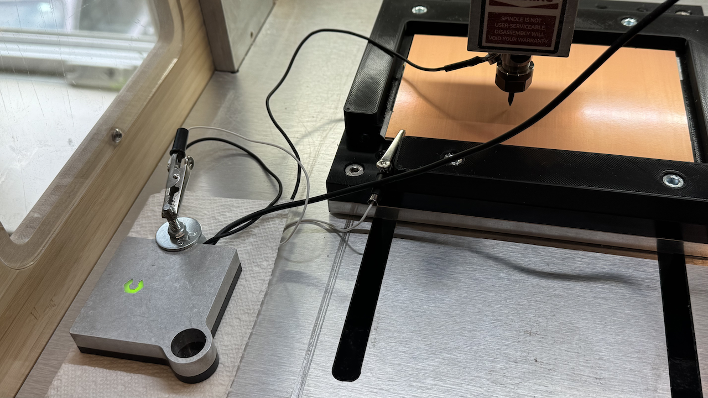

# Milling a PCB with auto-leveling using a Carbide 3D Nomad 3

I tried everything between [Carbide Copper](https://carbide3d.com/copper/), which seems abandoned at best and buggy at worst: it does not seem to spin the spindle. I played with [FlatCAM](http://flatcam.org/) and [bCNC](https://github.com/vlachoudis/bCNC), which I used to brick my Nomad 3. (I provide [instructions to reset the GRBL on a Nomad 3](https://github.com/thomergil/carbide3d-grbl-recovery?tab=readme-ov-file), much thanks to Carbide 3D support.)

Ultimately, I settled on [pcb2gcode](https://github.com/pcb2gcode/pcb2gcode) and [OpenCNCPilot](https://github.com/martin2250/OpenCNCPilot), which supports auto-leveling. Unfortunately—I typically use Mac and Linux—**OpenCNCPilot only works on Windows**. Annoying as that may be, it might be worth the sacrifice, in this case. You can operate your Nomad 3 fully using Windows.

# Example results


# Video (will navigate you away)

[](https://vimeo.com/1079839701/e5094529f5)

# Acknowledgements

This has been partly inspired by [Chris Kohlhardt's notes](https://www.chriskohlhardt.com/small-double-sided-pcb-traces-on-nomad-cnc). He does it with FlatCAM and bCNC. I found both rather inscrutable. Thank you to https://github.com/deHarro and https://github.com/martin2250 for the [feedback](https://github.com/martin2250/OpenCNCPilot/issues/201).

# CNC Machine

This has been tested on a [Carbide 3D Nomad 3](https://shop.carbide3d.com/products/nomad-3) CNC Mill.

# Mac? Windows? Linux?

Unfortunately, [OpenCNCPilot](https://github.com/martin2250/OpenCNCPilot) exists only for Windows. 🙁  It needs to be attached directly to the CNC Machine. I have not (yet) tried running it using a VM.

# PCB blanks / Copper Clad

I use 2x3" and 4x6" PCB blanks that I order [from Carbide 3D](https://shop.carbide3d.com/collections/materials/products/fr1-copper-clad?variant=41237063046). They are single-sided ("SS") or double-sided ("DS") and are also sold on Amazon and AliExpress.

You'll likely start with your entire PCB on one (the non-copper) side and soldering the pins on the copper side, so **you need single-sided copper clad**.

If you are planning to put, say, the ground plane on the opposite side, you will need **double-sided copper clad**.

Keep in mind that plugging in pins through double-sided copper clad will connect the pins on **both sides of the board, even if you only solder one side**. The edges of the pin will very likely make contact with the copper. I learned this the hard way. 💥

# Drill/Mill bits

30º V-bits:

* [#501 PCB Engraver (30º) bits from Carbide 3D](https://shop.carbide3d.com/products/501-engraving-bit?_pos=3&_psq=pcb&_ss=e&_v=1.0)
* [Coated 30º V-Groove bits from bits&bits](https://bitsbits.com/product/60-degree-v-groove/)
* [FoxAlien 30º bits via Amazon](https://a.co/d/37hDOj5)

40º V-bits:

* [#502 PCB Engraver (40º) bits from Carbide3D](https://shop.carbide3d.com/products/502-engraving-bit?_pos=2&_psq=pcb&_ss=e&_v=1.0)

60º V-bits:

* [Coated 60º V-Groove bits from bits&bits](https://bitsbits.com/product/425-vg30/)
* [FoxAlien 60º bits via Amazon](https://www.amazon.com/dp/B08881PKBN?ref=ppx_yo2ov_dt_b_fed_asin_title&th=1)

# Jigs

I provide [several different-sized jigs on printables.com](https://www.printables.com/model/1280313-copper-clad-pcb-jig-for-cnc-machine). Please be in touch if you need additional sizes. If you do not have access to a 3D printer, I can print them and send them to you for $49.99 plus shipping. Others can do it, no doubt, for much less. 🙂

# BitZero attachment

You need to rig the [BitZero V2](https://shop.carbide3d.com/products/bitzero-v2-for-nomad-3). Anything works as long as it conducts ground between the top of the copper clad and the BitZero. This is my solution:


The BitZero is squeezed on both sides by two metal rings, held in place by a bolt and screw; an alligator clip attaches to the bolt. The alligator clip connects to an alligator clip that attaches to the copper clad.



# Outline

* Adjust the PCB design.
* Export Gerber files.
* Attach copper to the jig with double-sided tape.
* Zero X, Y, Z.
* Probe to create a height map. This can take 15-30 minutes, depending.
* Mill front (for example, using a 30º V-bit). This can take 2-6 hours, depending.
* [Optional: flip, mill other side, flip back]
* Replace V-bit with a drill bit (for example, a 0.8mm PCB drill).
* Zero Z.
* Drill holes.
* Prepare to solder.
* Solder.

If you are milling both sides, you should **drill after milling both sides**; otherwise, you are level-probing a surface with holes.

# Single-layer design on B.Cu

This tutorial assumes you are making **a single-layer PCB** where you plug in components at the top and solder them at the bottom. This means **your entire PCB design needs to be on B.Cu**.

If you initially designed your board for manufacturing (e.g., JLCPCB, PCBWay, OSH Park, etc.), you likely put the GND plane on B.Cu and the signal traces on F.Cu. That will **not work** for CNC manufacturing. (I discovered this the hard way when all my pin holes were mirrored.)

To adapt the design for CNC manufacturing, you need to move all routing (including GND) to F.Cu. Since GND is no longer taken care of, this likely requires re-routing traces.

While you are at it, you need to also make the tracks wider and clearance wider: using **File** → **Board Setup** → **Design Rules** → **Net Classes**:

* Set **track width to a minimum 0.5mm**.
* Set **clearance to 0.58mm**, the maximum without things getting buggy. (I find that sometimes I have to set it to 0.34mm to avoid neighboring pins/vias from interfering.)

If you change this, you need to apply your changes using **Edit** → **Edit Track and Via Properties** → select **Set to net class / custom rule values** and **Apply**. Then run the **Design Rules Checker** and fix any errors due to the width changes. People [have reported thinner track widths](https://github.com/martin2250/OpenCNCPilot/issues/198), though.

Once everything is on F.Cu, you can swap F.Cu and B.Cu (using menu **Edit** → **Swap Layers...**) to transpose F.Cu to the back. Alternatively, if you are not planning to use a PCB manufacturing service, you can do all routing on B.Cu from the start.

# KiCad PCB Export

A few things to keep in mind when exporting from KiCad's PCB editor:

* Make the Edge Cut layer match exactly the dimensions of the PCB blank.
* Ensure enough space (at least 2mm) between the edges and the circuitry.
* Using menu **Place** → **Place Drill/Place File Origin**, place the origin at the bottom left of the Edge Cut layer.
* Similarly, using menu **Place** → **Grid Origin**, place the origin at the bottom left of the Edge Cut layer.


# KiCad Plot / Export

Using menu File → Plot...:

* :heavy_check_mark: F. Cu
* :heavy_check_mark: B. Cu
* :heavy_check_mark: Edge.Cuts
* :heavy_check_mark: Use drill/place file origin
* :x: Use extended X2 format (meaning, make sure this option is unchecked)


Then:

* Generate Drill Files...
* Excellon format
* Origin: Drill/place file origin
* Units: millimeters
* Zeros: decimal format (recommended)

Then press "Generate".


Back on the Plot window, press "Plot"

# Generate Gcode from .gbr files

Create a file `millproject` in the same directory as the `.gbr` files.

```
metric=true
metricoutput=true

# milling
zwork=-0.06          # Depth in mm. I've been lucky with -0.06mm.
zsafe=20             # Height for movements; can be as low as 2mm if you are confident
zchange=35           # Height for tool changes
mill-feed=100        # Feed rate in mm/minute
mill-speed=12000     # RPM for milling
nom6=1               # Don't issue M6 command
spinup-time=3.0      # Time to spin up the spindle in seconds
spindown-time=3.0    # Time to spin up the spindle in seconds
backtrack=1          # See https://github.com/pcb2gcode/pcb2gcode/issues/706
                     # Turn off if you don't like the esthetics of criss-cross lines
isolation-width=0.6  # Creates thicker grooves; eases soldering.
milling-overlap=25%  # Re-mill with 25% overlap as part of creating isolation width
                     # See https://github.com/pcb2gcode/pcb2gcode/issues/706 for a
                     # discussion about consequences of milling-overlap that's too high.

# Voronoi regions
voronoi=1            # Try it out! Makes soldering easier, but looks funky; default 0

# drilling
zdrill=-1.7          # Drill depth; measure your copper clad
drill-feed=60        # Feed rate in mm/minute
drill-speed=10000    # RPM for drilling
nog81=1              # Use G0/G1 instead of G81/G80
onedrill=1           # Use only one drill; don't swap sizes

# this will mess up offset! don't use!
# zero-start=true
```

Some of these values are **critically important**:

* `zsafe` is the travel height of the mill bit; **if this is too low your bit will crash into the jig, breaking the mill or worse**. Once you get the hang of it, you can make this as low as 2.
* `zchange` is the height for changing the mill bit; if you choose this number too high and your drill bit is long, the process will error out, because it runs into the hard limit of the machine.
* `zwork` is how deep the mill drills into the copper substrate; start with `0.5` (for a 30º Vbit) or `0.05` and iterate deeper as needed; this also depends on the V-bit you are using.
* `nom6=1` prevents `pcb2gcode` from issuing an `M6` command, which trips up the Nomad 3.
* `nog81` prevents `pcb2gcode` from issuing `G81` commands, which trips up OpenCNCPilot.
* For `--mill-diameters` you can use this [tool cutting width calculator](https://hobbycnc.com/tool-width-calculator/) to figure out the correct number.

Run [pcb2gcode](https://github.com/pcb2gcode/pcb2gcode) to generate the **back**, which, confusingly, is what we're going to mill.

```bash
# replace "decibel-meter-B_Cu.gbr" with your own .B_Cu file
# optional: --basename FOO to give file a nice prefix
# optional: --output-dir DIR to write file to another directory
# optional: --x-offset negative number moves the PCB to the right of the origin
# --mill-diameters: the width of your mill at the given zwork
pcb2gcode --back decibel-meter-B_Cu.gbr --mill-diameters=0.169
```

Generate the Excelon **drill** file:

```bash
# replace "decibel-meter-PTH.drl with your own .drl file
# optional: --basename FOO to give file a nice prefix
# optional: --output-dir DIR to write file to another directory
# optional: --x-offset negative number moves the PCB to the right of the origin
#           MAKE SURE THIS IS THE SAME AS THE SETTING FOR B_Cu ABOVE
pcb2gcode --drill decibel-meter-PTH.drl --drill-side back
```

You should now have  `.ngc` files.

# Attach copper clad to jig

Cover the entire bottom surface of the copper clad (all the way to the edges) with non-overlapping double-sided tape. Don't just tape the middle because the sides will flex downward during probing.


Then press the copper clad into the jig:


# OpenCNCPilot

OpenCNCPilot is a little quirky, but it does everything you need. Please start by reading through the [OpenCNCPilot README](https://github.com/martin2250/OpenCNCPilot/blob/master/README.md).

### General notes on OpenCNCPilot

* As you learn to use OpenCNCPilot, **stay close to your CNC machine with your finger on the power switch**.
* There is not enough vertical space in the user interface to fold open all menus, so you need to manage them. You'll use **File**, and **Edit**, and **Probing**, and **Manual**, and **Manual Probing**. I try to only ever open one at a time and close the ones I don't use.
* You can reposition the view by double-clicking the right mouse button. You can rotate and pitch the view by dragging the view with the right mouse button. You can zoom in and out with the mouse wheel (or whatever equivalent trackpad gesture you have). Also, under the **Debug** menu (on the right) you can **Lay flat 3D Viewport** and **Restore Viewport**.

Ho

* While learning OpenCNCPilot, I destroyed a half-dozen mill bits. I suggest you **start with cheap throwaway bits** while you're learning.
* You can home to (X = 0, Y = 0) without changing height by typing `G0 X0 Y0` in the field under the **Manual** menu and then pressing **Send**. Make sure the bit is at a safe height.


* Consider making two macros you will use frequently using the **Macro menu**:
  *  `G0 X0 Y0` to **Home to (0, 0)**
    (This moves the spindle to the current home location without changing Z.)
  * `G10 L20 P1 Z0` to **Set Z=0**
    (This sets whatever the spindle is currently at as Z=0 without changing X, Y.)

* If the machine gets stuck or OpenCNCPilot seems frozen, try the **Soft Reset** button before resetting the machine. Also: you forgot the magnet on the door sensor. 🙂

### OpenCNCPilot and Carbide Motion don't play nice

Switching **to** OpenCNCPilot after using Carbide Motion is usually OK. However, using Carbide Motion **after** OpenCNCPilot can fail in mysterious ways, starting with initialization and homing. Stay close and keep your finger on the power button. If weird things happen, follow my [instructions to reset the GRBL on a Nomad 3](https://github.com/thomergil/carbide3d-grbl-recovery?tab=readme-ov-file).

### Start OpenCNCPilot

Using the **Machine** menu on the right, **Connect** to the printer and **Home Machine**.

**If it's not working**: reset the machine, close, and open OpenCNCPilot. Make sure the door magnet is engaged.

### Load the Gcode

Using the **File** menu, load the `.ngc` file generated by `pcb2gcode`. You should see a visualization of your PCB.

### Set the zero point for X and Y (but Z comes later)

In the **Manual** menu, :heavy_check_mark: the **Enable Keyboard Jogging**, and set Feed to 100, click inside the **Jogging Keyboard Focus** and use the left, right, up, down, page up, page down keys to maneuver the mill bit to the bottom left corner of the copper clad. You can increase the **Feed** to 5000 and increase **Max Distance** for larger motions. When you get close, reduce **Feed** to 500, then 50, or even 10.


Make sure you get exactly to the bottom left corner in terms of X and Y, but don't worry about the right Z. I look at the bit with one eye, both from the front and from the side window, to ensure it's correctly aligned with the corner. You can stay slightly above the surface. Try to get it within 1mm. We will take care of Z below.


Once the mill is positioned correctly, press the **Zero (G10)** button and then **Send** it to the machine.

If you need to re-home or reset the machine, you can verify that X and Y are still correct by sending `G0 X0 Y0` (or your **Home to (0, 0)** macro) to the machine using the **Manual** menu. Make sure the mill is high enough when you do!

### Raise the bit to a comfortable height

Set **Feed** to 5000 and raise the bit. Center it roughly above the copper clad.

### Ensure Manual Probe offsets are zero

Open the **Manual Probe** menu and set both **Probe Offset** values to 0.


### Prepare Auto-Level probing

Open the **Probe** menu:

* If necessary, press **Clear**.
* Press **Create New**.
* Set Grid Size to 3. (4 is not enough; 2 is probably unnecessary.)
* Set X and Y values such that the red dots surround your PCB. The PCB needs to fit **inside** the red dots. You should add at least a margin 2mm around your PCB.
* **Hint:** If you are concerned about probing past the edge of the copper clad—trust me, this will happen to you too, and you'll break your drill bit—you should manually jog the mill to the edge. The user interface will show you (through the blue virtual mill) where you are. You can arrange the red dots accordingly, ensuring you always stay on the copper clad.
* Press **OK**.


### Get hardware ready

* Attach the magnet against the collar.
* Clip the alligator clip on the copper clad.
* Clip the other alligator clip on the BitZero rig.


### Run Probe

Stay close to the machine.

* Verify that the mill is positioned in the center above the copper clad.
* Press **Run** in the **Probe** menu.

If the machine pauses or freezes, press the **Start** button. There are **TWO** Start buttons! Sometimes, you need to use the one in the **File** menu, and sometimes, you need to use the one at the top of the user interface.

The mill will lower very, very slowly until it touches the surface of the copper clad. It will visit all red points. Don't worry about the order; it will eventually visit all of them.

The result will be a height map:


### Remove all hardware

Remove all the hardware from the CNC. Carefully remove the alligator clip without pulling on the copper clad.

### Apply HeightMap

In the **Edit** menu, press **Apply HeightMap**.

### Start!

Under **File**, press **Start**.

If the machine pauses or freezes, press the **Start** button. There are **TWO** Start buttons! Sometimes, you need to use the one in the **File** menu; at other times, you need to use the one at the top of the user interface. (I am [confused about this](https://github.com/martin2250/OpenCNCPilot/issues/200).)

### Replacing bits for drilling and/or flipping the copper clad

When you replace a bit (for example, to go from milling to drilling), you **must set Z again**:

* Using keyboard jogging, raise the mill to a comfortable height.

* Replace the bit.

* Attach the rigged BitZero.

* Using keyboard jogging, carefully lower the Feed from 5000 to 500 to 50 to 10 until the bit touches the copper clad and the BitZero light turns red.

* Send the `G10 L20 P1 Z0` command or use the **Set Z=0** macro you created. You have now re-zeroed Z.

* **Load** the drilling Gcode

* **Apply HeightMap**

* **Start**

If you flipped the board, you must zero X, Y, and Z, and re-plot before milling/drilling again:

* Using keyboard jogging, raise the mill to a comfortable height.
* Replace the bit.
* Attach the rigged BitZero.
* Using keyboard jogging, move the drill anywhere over the board, then carefully lower the drill bit (while decreasing the Feed from 5000 to 500 to 50 to 10 as you do this) until the BitZero turns red.
* Press the **Zero (G91)** key and **Send**.
* Raise the mill back to a comfortable height.
* Remove the rigged BitZero.
* If you flipped the board, you must plot a height map again before milling or drilling and **Apply HeightMap** to the drill file.

# Soldering

* Sand the copper surface with 600+ grit sandpaper or 0000 steel wool. Sand in **one direction only**; do not make circular motions.
* Clean the surface with isopropyl alcohol using a dust-free cloth.
* Stick the pin headers or components through the holes.
* Dab the tips and copper with a flux pen. Don't worry about flux being absorbed by the fiberglass.
* Use magnifying glasses.
* Use the finest soldering tip.
* Use very thin (lead-based) flux core solder.
* Solder the pins to the copper pads; use as little solder as possible.


